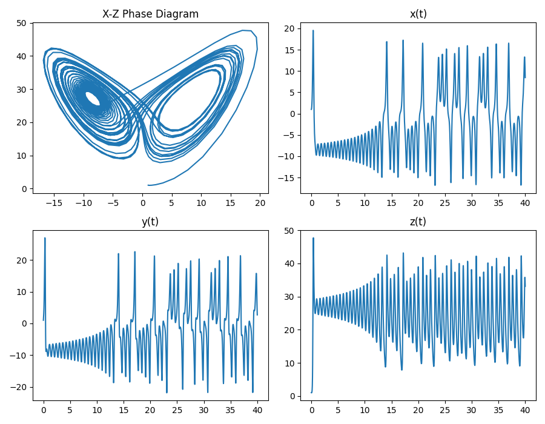

# RK Solvers #

## Functions ##

### `explicit_solver_fixed_step` ###
Basic explicit RK solver for any order given correct butcher tableau inputs. Time step is constant and is an argument.

### `dp_solver_adaptive_step` ###
A solver using the Dorman-Prince Method, which is an embedded method that calculates a fourth and fifth order solution in order to estimate the local error.  
It uses adaptive time steps which decreases time step in unstable regions and increases time step in stable regions to minimise error.  
The initial time step is $ 10^{-3} $.

### `backward_euler_solver` ###
An implicit solver using the backwards euler method.  
Estimates the next position using the derivative of the next point instead of using the derivative of the current point. This method provides numeric stability, but not necessarily accuracy.

# Example #
## Example of Lorenz System Solution Using the DP Solver ##

From the file `example.py`.

